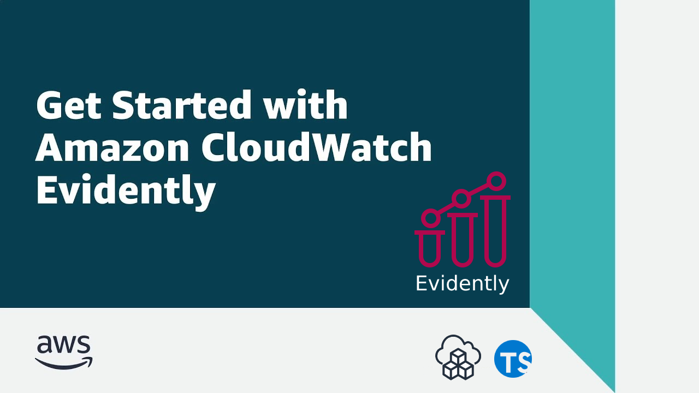

<p align="center">
  <a href="https://dev.to/vumdao">
    
  </a>
</p>
<h1 align="center">
  <div><b>CDK AWS Cloudwatch Evidently Demo</b></div>
</h1>

## Abstract
- [Cloudwatch evidently](https://docs.aws.amazon.com/AmazonCloudWatch/latest/monitoring/CloudWatch-Evidently.html) - Safely launch new features and validates web application choices by conducting online experiments and then decide if your experiment should be terminated depending on the results of the experiment.
- In this post, we try the feature flag control for the user who performed the login process using Cognito. It leverage the CDK typescript to provide cloudwatch evidently project, feature, launches and experiment, also using AWS Amplify to provide web app and login method using Amazon cognito authentication and cognito identity pool

## Table Of Contents
 * [Overview of Cloudwatch evidently](#Overview-of-Cloudwatch-evidently)
 * [Create cloudwatch evidently project and its features, launches and experiments](#Create-cloudwatch-evidently-project-and-its-features,-launches-and-experiments)
 * [Building Evidently Metrics](#Building-Evidently-Metrics)
 * [Deploy cloudwatch evidently stack](#Deploy-cloudwatch-evidently-stack)
 * [Use Amplify to start webapp for testing evidently](#Use-Amplify-to-start-webapp-for-testing-evidently)
 * [Test evidently feature](#Test-evidently-feature)
 * [Conclusion](#Conclusion)

---

## 🚀 **Overview of Cloudwatch evidently** <a name="Overview-of-Cloudwatch-evidently"></a>
- You can use [Amazon CloudWatch Evidently](https://aws.amazon.com/cloudwatch/features/) to safely validate new features by serving them to a specified percentage of your users while you roll out the feature. You can monitor the performance of the new feature to help you decide when to ramp up traffic to your users. This helps you reduce risk and identify unintended consequences before you fully launch the feature.
- Evidently structure
  - Project: The logical object in Evidently that can contain features, launches, and experiments. Use projects to group similar features together. We can store evaluation events for longer term storage by using cloudwatch log or S3 bucket
  - Feature: represents a feature that you want to launch or that you want to test variations of.
  - Launch: To expose a new feature or change to a specified percentage of your users, create a launch
  - Experiment: Use experiments to test different versions of a feature or website and collect data from real user sessions. This way, you can make choices for your application based on evidence and data

  

## 🚀 **Create cloudwatch evidently project and its features, launches and experiments** <a name="Create-cloudwatch-evidently-project-and-its-features,-launches-and-experiments"></a>
- First, we create a project for the application feature and store evaluation events to S3 bucket. For CDK, at the time of writing this, there's only L1 construct
  ```
    const s3 = new Bucket(this, `${prefix}-evidently-demo-data-storage`, {
      bucketName: `${prefix}-evidently-demo-data-storage`,
      blockPublicAccess: BlockPublicAccess.BLOCK_ALL,
      encryption: BucketEncryption.S3_MANAGED,
      removalPolicy: RemovalPolicy.DESTROY,
      enforceSSL: true
    });

    const proj = new CfnProject(this, `${prefix}-evidently-demo`, {
      description: 'S3 bucket to store evidently project evaluation events',
      name: `${prefix}-evidently-demo`,
      dataDelivery: {
        s3: {bucketName: s3.bucketName}
      },
      tags: InsideTags('evidently', reg)
    });
  ```

- Create a feature for the project. The feature use `Variation type : Boolean` with 2 variations `Variation1: false` and `Variation2: true` represent for enabling or disabling the feature or in another words display/hide or on/off feature on the application
  ```
    const feature = new CfnFeature(this, `${prefix}-evaluation-demo`, {
      description: 'Evaluation-demo feature',
      name: `${prefix}-evaluation-demo`,
      project: proj.name,
      variations: [
        {booleanValue: false, variationName: 'Variation1'},
        {booleanValue: true, variationName: 'Variation2'}
      ],
      defaultVariation: 'Variation1',
      evaluationStrategy: 'ALL_RULES',
      tags: InsideTags('evidently', reg)
    });
    feature.node.addDependency(proj);
  ```

- Create launch: split Variation and traffic to 20% and 80%, set start now and add the launch to the feature
  ```
    const launch = new CfnLaunch(this, `${prefix}-launch-test`, {
      name: `${prefix}-launch-test`,
      project: proj.attrArn,
      groups: [
        {
          groupName: 'test-launch-1',
          feature: feature.name,
          variation: 'Variation1'
        },
        {
          groupName: 'test-launch-2',
          feature: feature.name,
          variation: 'Variation2'
        }
      ],
      scheduledSplitsConfig: [
        {
          groupWeights: [
            {
              groupName: 'test-launch-1',
              splitWeight: 20000,
            },
            {
              groupName: 'test-launch-2',
              splitWeight: 80000,
            },
          ],
          startTime: new Date().toISOString()
        }
      ],
      executionStatus: {status: 'START'},
      tags: InsideTags('evidently', reg)
    });
    launch.node.addDependency(feature);
  ```

## 🚀 Building Evidently Metrics <a name="Building-Evidently-Metrics"></a>
- Metrics are defined by applying rules to data events. We use `putProjectEvents` to sends performance events to Evidently. These events can be used to evaluate a launch or an experiment.
- Evidently collects experiment data and analyzes it by statistical methods, and provides clear recommendations about which variations perform better.
- To make a demo of this, We create a new feature similar to above and create an experiment associated with the feautre. The experiment includes following properties
  - `metricGoals`
    - with `desiredChange` set to `INCREASE` means that a variation with a higher number for this metric is performing better.
    - The goal references to the custom metric and the metric rule bases on the `eventPattern` which is sent from `putProjectEvents`.
      - The rule
        ```
        {
          "entityIdKey": "entityId",
          "valueKey": "details.loadTime",
          "eventPattern": {
            "entityId": [
              {
                "exists": true
              }
            ],
            "details.loadTime": [
              {
                "exists": true
              }
            ]
          }
        }
        ```

      - The event payload sent from application in evaluation process
        ```
        const _data = {
          entityId: user.username,
          details: {
            loadTime: elapse,
          }
        };

        const _event = {
          data: JSON.stringify(_data),
          timestamp: new Date(),
          type: 'aws.evidently.evaluation'
        }
        ```
  - `onlineAbConfig` defines treatment with specified splitWeight, total treatments must be 100%
  - `treatments` associates treatments defined above with the feature and according variant
  - Source code
    ```
      const featureExp = new CfnFeature(this, `${prefix}-evaluation-exp`, {
        description: 'Evaluation-demo feature exp',
        name: `${prefix}-evaluation-exp`,
        project: proj.name,
        variations: [
          {booleanValue: false, variationName: 'Variation1'},
          {booleanValue: true, variationName: 'Variation2'}
        ],
        defaultVariation: 'Variation1',
        evaluationStrategy: 'ALL_RULES',
        tags: InsideTags('evidently', reg)
      });
      featureExp.node.addDependency(proj);

      const exp = new CfnExperiment(this, `${prefix}-experiment`, {
        name: `${prefix}-experiment`,
        project: proj.name,
        description: 'Test experiment',
        metricGoals: [{
          desiredChange: 'INCREASE',
          entityIdKey: 'entityId',
          metricName: 'load-time-in-second',
          eventPattern: JSON.stringify(eventPattern),
          valueKey: "details.loadTime"
        }],
        onlineAbConfig: {
          controlTreatmentName: `${prefix}-experiment-treatment-1`,
          treatmentWeights: [
            {
              splitWeight: 20000,
              treatment: `${prefix}-experiment-treatment-1`
            },
            {
              splitWeight: 80000,
              treatment: `${prefix}-experiment-treatment-2`
            }
          ]
        },
        treatments: [
          {
            treatmentName: `${prefix}-experiment-treatment-1`,
            feature: featureExp.name,
            variation: 'Variation1'
          },
          {
            treatmentName: `${prefix}-experiment-treatment-2`,
            feature: featureExp.name,
            variation: 'Variation2'
          }
        ],
        runningStatus: {
          status: 'START',
          analysisCompleteTime: '2022-09-27T06:47:03.387Z'
        }
      });
      exp.node.addDependency(featureExp)
    ```

## 🚀 **Deploy cloudwatch evidently stack** <a name="Deploy-cloudwatch-evidently-stack"></a>
- The source code is ready, we now deploy the stack to create cloudwatch evidently project, feature and start the launch
  ```
  cdk deploy CloudwatchEvidentlyStack --profile mfa --concurrency 2 --require-approval never
  ```

- Check the project created which has 2 features, 1 launch and 1 experiment

  

- Feature demo rule orders: lauches -> default

  

- Feature with experiment

  

## 🚀 **Use Amplify to start webapp for testing evidently** <a name="Use-Amplify-to-start-webapp-for-testing-evidently"></a>
- AWS Amplify is a complete solution that lets frontend web and mobile developers easily build, ship, and host full-stack applications on AWS, with the flexibility to leverage the breadth of AWS services as use cases evolve. No cloud expertise needed.
- By using Amplify, we can build the Reac application with authentication by using cognito userpool and policy access control to AWS cloudwatch evidently by cognito identity pool
- In this post, we don't use CDK to provide Amplify components completely but adding Authentication component through Amplify studio (or you can use amplify cli)
- First, create Amplify console with following settings
  - Service role which Amplify requires permissions to deploy backend resources with your front end
  - `GitHubSourceCodeProvider` connect amplify to github repository `aws-cloudwatch-evidently-react`. Note that, Amplify already supports GitHub App to authorize access to repositories for CI/CD workflows with least privilege.
  - `buildSpec` defines backend and frontend buid phases
- Source code: [amplify-console.ts](https://github.com/vumdao/aws-cloudwatch-evidently/blob/master/src/amplify-console.ts)
- Deploy
  ```
  cdk deploy AmplifyConsoleReactStack --profile mfa
  ```

- After deploy done, following steps to setup backend and deploy build FE app
  1. We should start migration to `Install and authorize GitHub App`

    

  2. Launch `Backend environments` studio to add `Authentication` component

    

    

  3. Clone backend staging to `prod` and assocaite `main` branch with `prod` backend

    

    

  4. Trigger build FE with the `main` branch, after the build we will have the URL to access react app

    

- Let's have a look at react app [source code](https://github.com/vumdao/aws-cloudwatch-evidently-react/tree/main) to see how we create `Evidently` client to send `evaluateFeatureRequest` to the project and `putProjectEvents` for custom metric as experiment

## 🚀 **Test evidently feature** <a name="Test-evidently-feature"></a>
- After creating account and login successfully we will see the following error

  

  It's due to the identity pool default Authenticated role which is assumed by cognito userpool does not have permission to work with Cloudwatch evidently, we need to provide `AmazonCloudWatchEvidentlyFullAccess` and also S3 permision to push data event storage to S3 bucket. To limit the application permission toward cloudwatch evidently, read [Actions, resources, and condition keys for Amazon CloudWatch Evidently](https://docs.aws.amazon.com/service-authorization/latest/reference/list_amazoncloudwatchevidently.html#amazoncloudwatchevidently-actions-as-permissions) to create proper policy for the role

  

- Successful load with evaluation routed to `Variation1` with value `false`

  

  

- Switch app to experiment feature

  

  

## 🚀 **Conclusion** <a name="Conclusion"></a>
- With CDK, we can provision cloudwatch evidently using infrastructure as code and can update, modify or create new project, feature, launch, experiment though cdk pipeline
- We make a demo using Amplify for react app easily and improve security using cognito userpool and cognito identity pool through access token and role attached.
- In practice where we don't use amplify, we can inherrit the flow of the above authentication as best practice.

---

**References:**
- [New – Amazon CloudWatch Evidently – Experiments and Feature Management](https://aws.amazon.com/blogs/aws/cloudwatch-evidently/)
- [[New feature] Support feature flags and A/B testing! Amazon CloudWatch Evidently was released, so I tried it #reinvent](https://dev.classmethod.jp/articles/amazon-cloudwatch-evidently-ga/)

---

<h3 align="center">
  <a href="https://dev.to/vumdao">:stars: Blog</a>
  <span> · </span>
  <a href="https://github.com/vumdao/aws-cloudwatch-evidently/">Github</a>
  <span> · </span>
  <a href="https://stackoverflow.com/users/11430272/vumdao">stackoverflow</a>
  <span> · </span>
  <a href="https://www.linkedin.com/in/vu-dao-9280ab43/">Linkedin</a>
  <span> · </span>
  <a href="https://www.linkedin.com/groups/12488649/">Group</a>
  <span> · </span>
  <a href="https://www.facebook.com/CloudOpz-104917804863956">Page</a>
  <span> · </span>
  <a href="https://twitter.com/VuDao81124667">Twitter :stars:</a>
</h3>